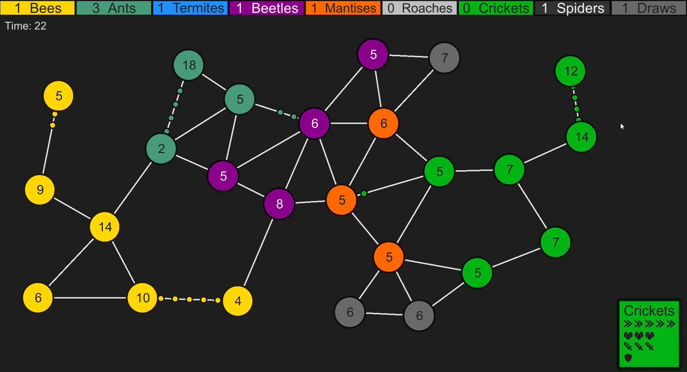

# BugBackground
A virtual desktop background based on the flash games Bug Wars built in Unity. A graph of nodes is created and agents are created to fight for control of the network.

It's designed to work with virtual wallpaper engine through Steam. The simulation runs until one agent wins or until time runs out.

I might go back and build it into a game. It's playable/interactive now. Just click on one of the nodes to take control of the agent.

